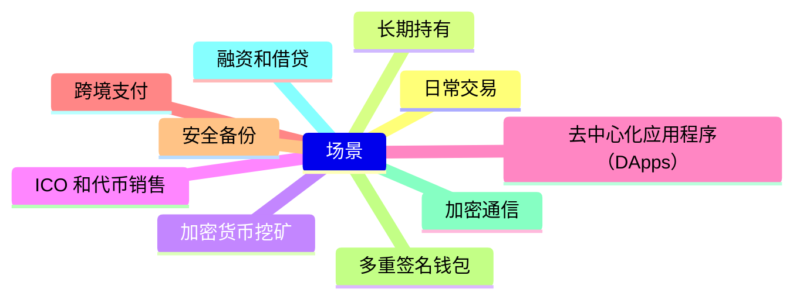

> 钱包听名字就知道它是我们承载钱的工具，重要程度必须给🌟🌟🌟🌟🌟

> not your keys, not your coin

# 背景

&emsp;&emsp;钱包在Web3中起到了关键作用，使用户能够与区块链网络和去中心化应用程序进行互动，同时保护他们的数字资产和隐私。 
&emsp;&emsp;选择适合你需求的钱包非常重要，因为不同的钱包可能提供不同的功能、安全性级别和用户体验
     
# 目的
&emsp;&emsp;通过对不同钱包类型的存储介绍，以及使用场景的分析，让读者更了解应该选择什么样的钱包。
# 不同钱包私钥的存储方式
1. 硬件钱包
    - 硬件钱包是一种专门设计用于存储加密货币私钥的物理设备。它们通常是离线的，不容易受到网络攻击。
    - 知名的硬件钱包品牌包括 Ledger Nano S, Ledger Nano X, Trezor 等。
    - 使用硬件钱包时，私钥被存储在设备中，需要物理访问设备才能进行交易。这提供了额外的安全性
2. 纸钱包
    - 纸钱包是一个包含你的加密货币地址和私钥的印刷文档。通常以二维码的形式提供。
    - 这是一种离线存储的方式，不容易受到网络攻击。但务必将纸钱包保管好，避免遗失或损坏
3. 冷存储
    - 冷存储是一种将私钥存储在没有连接互联网的设备上的方式。这可以包括硬件钱包、未连接到网络的计算机、USB 驱动器等。
    - 冷存储提供了高级别的安全性，因为私钥不暴露于在线环境中。

4. 多重签名钱包

    - 多重签名钱包需要多个私钥来进行交易的授权。这可以增加安全性，因为单个私钥的泄露不会导致资产的失窃。
    - 通常，多重签名需要多个设备或账户的签名才能执行交易。

5. 加密存储
    -   有些人选择使用加密技术来保护他们的私钥。他们可以将私钥存储在加密容器中，只有在提供正确的密码或密钥时才能解锁。

6. 在线钱包

    -   在线钱包通常将私钥存储在互联网上，因此它们可能会面临网络攻击的风险。
    -   如果使用在线钱包，确保选择一个有良好声誉和强大安全性措施的提供商。

7. 操作系统钥匙链

    -   有些操作系统（如 macOS 和 Windows）提供了一个安全的钥匙链工具，可用于存储和管理私钥。

# 对比

| 钱包类型           | 私钥存储方式                         | 安全性评级    | 优点                                       | 缺点                                  |
|------------------|------------------------------------|------------|------------------------------------------|-------------------------------------|
| 硬件钱包           | 存储在离线设备中，需要物理访问设备才能访问 | 高          | 高度安全，离线存储，免受网络攻击              | 设备丢失或损坏可能导致私钥丧失             |
| 纸钱包            | 印刷的纸质文档，包含地址和私钥            | 中等         | 离线存储，不容易受到网络攻击                  | 纸张容易损坏或丢失                     |
| 冷存储            | 存储在未连接互联网的设备上                | 高          | 离线存储，不容易受到网络攻击                  | 不便携，需要物理访问设备                |
| 多重签名钱包         | 需要多个私钥进行授权交易                 | 高          | 分散风险，不依赖单个私钥                     | 复杂度较高，需要多个签名               |
| 加密存储           | 私钥存储在加密容器中                   | 中等         | 加密保护，提供额外的安全性                    | 密码丢失或泄漏可能导致私钥丧失           |
| 在线钱包           | 私钥存储在互联网上                    | 低          | 方便访问，易用性高                           | 更容易受到网络攻击，不适用于大额资产       |
| 操作系统钥匙链        | 私钥存储在操作系统的钥匙链中             | 中等         | 集成于操作系统，易于管理                      | 取决于操作系统的安全性                     |

# 钱包的使用场景
&emsp;&emsp;加密货币钱包的使用场景多种多样，取决于个人或组织的需求以及加密货币的用途。以下是一些我思考过后总结的一些场景，欢迎补充。

1. **日常交易**：
   - 用于存储和管理加密货币以进行日常购物和交易。
   - 使用轻量级的移动钱包或在线钱包进行快速的小额支付。
   - 推荐使用移动钱包，如Trust Wallet（适用于多个加密货币）或Coinbase Wallet（适用于以太坊和以太坊生态系统的代币）。
    - 对于大宗交易，可以考虑使用硬件钱包，如Ledger Nano S或Trezor。

2. **长期持有**：
   - 用于长期投资和资产保存。
   - 偏向于安全性较高的硬件钱包、冷存储或多重签名钱包。
   - 推荐使用硬件钱包，如Ledger Nano X、Trezor Model T或KeepKey。
   - 这些硬件钱包提供了极高的安全性，并且适合长期存储大量的加密货币。

3. **加密货币挖矿**：
   - 挖矿收益的存储和管理。
   - 使用特定的钱包来接收挖矿奖励，通常是硬件钱包或在线钱包。
   - 对于挖矿收益的存储，硬件钱包是首选，以确保安全性。
   - Ledger Nano S或Trezor Model T可以是不错的选择。

4. **ICO 和代币销售**：
   - 用于参与初次代币发行（Initial Coin Offering）或代币销售。
   - 使用支持特定代币的钱包来接收和存储代币。
   - 使用支持特定代币的钱包，通常是以太坊钱包，如MetaMask或MyEtherWallet。
   - 请确保你的钱包支持所需代币。

5. **去中心化应用程序（DApps）**：
   - 用于与去中心化应用程序进行交互，包括游戏、金融应用和社交媒体。
   - 使用支持去中心化应用程序的钱包，如 MetaMask、Trust Wallet、欧易 web3 Wallet。

6. **跨境支付**：
   - 用于进行跨境汇款和支付，绕过传统银行系统。
   - 使用加密货币钱包可以快速、安全地进行国际支付。

7. **安全备份**：
   - 用于备份重要文件、密码和私钥。
   - 硬件钱包、纸钱包或冷存储通常用于安全存储重要信息。

8. **多重签名钱包**：
   - 用于组织或公司，需要多个授权才能进行交易。
   - 提供额外的安全性和控制，通常用于资产共管。
   - 如支持多签的硬件钱包Ledger Nano X。也可以考虑使用多签钱包服务，如BitGo。

9. **加密通信**：
   - 用于加密消息和通信。
   - 一些钱包具有加密通信功能，使用户可以安全地与其他用户进行互动。

10. **融资和借贷**：
    - 用于借贷和融资平台，存储用于质押或借贷的加密货币。
    - 一些借贷平台要求用户使用特定的钱包来进行借贷操作。
    - 使用支持借贷和融资平台的钱包，如Compound或Aave，存储用于质押或借贷的加密货币。

# MPC钱包
&emsp;&emsp;MPC（Multi-Party Computation）钱包是一种基于密码学的安全多方计算技术，用于保护加密货币的私钥。MPC 钱包采用分布式方法，将私钥划分为多个部分，并将这些部分存储在不同的地点，以提高安全性。以下是有关MPC钱包的一些关键特点：

1. **多方合作**：MPC钱包需要多方合作来生成和使用私钥。这些合作方通常是分布式网络中的节点或参与者。

2. **分散存储**：私钥的部分存储在不同的地点，通常是不同的设备或服务器上。这意味着即使一部分私钥受到威胁，攻击者也无法获得完整的私钥。

3. **安全计算**：MPC技术允许不同的部分合作进行计算，而不会暴露私钥的任何一部分。这确保了私钥的保密性。

4. **无单点故障**：MPC钱包不依赖于单一的中心化设备或实体。因此，没有单一点可以成为攻击的目标。

5. **高度安全性**：MPC钱包被认为是一种高度安全的私钥管理方法，适用于保护大量的加密货币资产。

6. **应用范围**：MPC钱包可以用于各种加密货币，包括比特币、以太坊和其他区块链资产。

&emsp;&emsp;虽然MPC钱包提供了高级别的私钥安全性，但它们通常较复杂，需要多方合作。用户需要仔细研究和理解如何设置和使用MPC钱包，以确保正确管理其加密货币资产。另外，选择可信赖的MPC钱包提供商也是至关重要的，因为他们管理了私钥的一部分。

# 想要了解MPC更多
[全面解析MPC和智能合约钱包的优缺点与面临的挑战](https://www.odaily.news/post/5183236)

# 思考
个人想法，随着监管的进一步完善，MPC钱包是比较好的方案选择。
